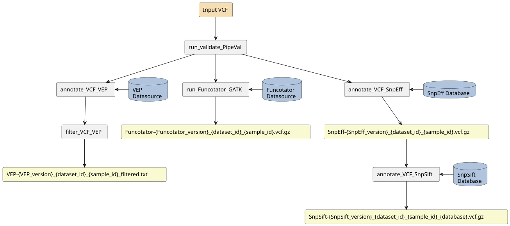

# Pipeline-annotate-VCF

- [Pipeline-annotate-VCF](#pipeline-annotate-vcf)
  - [Overview](#overview)
  - [How To Run](#how-to-run)
  - [Flow Diagram](#flow-diagram)
  - [Pipeline Tools](#pipeline-tools)
    - [SnpEff/SnpSift](#snpeffsnpsift)
    - [VEP](#vep)
    - [Funcotator](#funcotator)
  - [Inputs](#inputs)
    - [BCFtools Specific Configuration](#bcftools-specific-configuration)
    - [SnpEff Specific Configuration](#snpeff-specific-configuration)
    - [GATK Funcotator Specific Configuration](#gatk-funcotator-specific-configuration)
    - [VEP Specific Configuration](#vep-specific-configuration)
  - [Profiles](#profiles)
  - [Outputs](#outputs)
  - [References](#references)
  - [Discussions](#discussions)
  - [Contributors](#contributors)
  - [License](#license)

## Overview

Pipeline-annotate-VCF is an annotation pipeline that contains multiple tools to annotate VCFs. The input of pipeline-annotate-VCF takes properly formatted VCFs, such as WEX/WGS samples processed by [pipeline-call-sSNV](https://github.com/theboutroslab/pipeline-call-sSNV). Tools include SnpEff/SnpSift, GATK Funcotator, and VEP.

---

## How To Run

1. Copy [template.config](config/template.config) to your own directory and update params section of [template.config](config/template.config) file.

2. Copy [template.yaml](input/template.yaml) to your own directory and update the sample information in [template.yaml](input/template.yaml).

3. Run the pipeline with `nextflow run ...` through either local runs or through scheduler job.

### Requirements
Currently supported Nextflow versions: `v23.04.2`

---

## Flow Diagram

---

## Pipeline Tools

### SnpEff/SnpSift

> [SnpEff](http://pcingola.github.io/SnpEff/) annotates the genetic variants using built databases and predicts their functional effects.
The expected input is a VCF file, and the output includes an annotated `*.vcf.gz`, a result summary `*.html`, and a gene list `*.txt` file. Detailed information about input and output files can be found [here](http://pcingola.github.io/SnpEff/se_inputoutput/#bed-files).
> [SnpSift](http://pcingola.github.io/SnpEff/ss_introduction/) filters SnpEff-annotated files to select the variants that are significantly changed.
The expected input is a VCF file and a database VCF file (e.g. ClinVar, dbSnp, etc.). The output of SnpSift is an annotated `*.vcf.gz`.

### VEP

> [VEP](https://uswest.ensembl.org/info/docs/tools/vep/script/vep_tutorial.html) is a toolset that annotates and filters genetic variants. It provides detailed annotations of the functional effects on regulatory regions, including both well-defined sequence changes and large structural variants.

### Funcotator

>  [Funcotator](https://gatk.broadinstitute.org/hc/en-us/articles/360035889931-Funcotator-Information-and-Tutorial) utilizes a set of variant annotation databases to annotate the given variant functions and can filter variants based on matching criteria.
The expected input is a VCF file and a Funcotator datasource directory, and the output includes an annotated `*.vcf.gz`. The Funcotator datasource directory integrates multiple databases, such as ClinVar, dbSNP, COSMIC, etc.

---

## Inputs
To run the pipeline, one input `*.YAML` and one `template.config` are needed. When running a batch of samples, `template.config` can be shared, while the input YAML is unique for each sample.
| Input and Input Parameter | Required | Type | Description | Location |
| ------------------------- | -------- | ---- | ----------- | -------- |
| algorithm | yes | string | tools to be used when running the annotation pipeline | config |
| genome_version | yes | string | genome version for SnpEff Database, genome version correlates with the database directory name and can be found under `/path/to/tool-specific-input/SnpEff/data/` | config |
| output_dir | yes | path | location where outputs will be saved  | config File |
| save_intermediate_files | yes | boolean | whether to save intermediate files, default is `false` | Config File |
| work_dir | no | path | path of working directory for Nextflow. When included in the sample config file, Nextflow intermediate files and logs will be saved to this directory. With ucla_cds, the default is `/scratch` and should only be changed for testing/development. Changing this directory to `/hot` or `/tmp` can lead to high server latency and potential disk space limitations, respectively. |

### BCFtools Specific Configuration
| Input and Input Parameter | Required | Type | Description | Location |
| ------------------------- | -------- | ---- | ----------- | -------- |
| skip_normalization | yes | boolean | whether to skip the vcf normalization process, default is `false` | config |
| bcftools_view_options | no | string | the command used after `bcftool view`, if leave empty, the default filtering command is `--trim-alt-alleles` | config |
| bcftools_norm_options | no | string | the command used after `bcftool norm`, if leave empty, the default normalization command is `-a -m +any` | config |

### SnpEff Specific Configuration
| Input and Input Parameter | Required | Type | Description | Location |
| ------------------------- | -------- | ---- | ----------- | -------- |
| SnpEff_data_dir | yes | path | the directory that stores the SnpEff file, default is `/pth/to/tool-specific-input/SnpEff/data/` | config |
| SnpEff_download | yes | boolean | whether to download SnpEff from online database, default is `false` | config |
| SnpSift_annotate_database | yes | list | the databases used for `SnpSift annotate` process, such as ClinVar, AlphaMissense | config |

### GATK Funcotator Specific Configuration
| Input and Input Parameter | Required | Type | Description | Location |
| ------------------------- | -------- | ---- | ----------- | -------- |
| reference | yes | path | reference `.fa` file (`.fai` and `.dict` file must exist in same directory) | config |
| Funcotator_data_source | yes | path | path to a data source folder for Funcotator, pre-downloaded database can be found here `/path/to/tool-specific-input/Funcotator/` | config |
| Funcotator_output_format | yes | string | output format of Funcotator, the two options are `VCF` and `MAF` | config |
| Funcotator_extra_options | no | string | extra options used for Funcotator | config |
| Funcotator_b37_to_hg19_conversion | yes | boolean | used when the reference is GRCh37, to allow the conversion of hg19 database to fit GRCh37 reference, default is `false`, see GATK documentation [here](https://gatk.broadinstitute.org/hc/en-us/articles/360035889931-Funcotator-Information-and-Tutorial#2.2.6).  | config |

### VEP Specific Configuration
| Input and Input Parameter | Required | Type | Description | Location |
| vep_cache | yes | path | VEP cache. See [here](https://useast.ensembl.org/info/docs/tools/vep/script/vep_cache.html) |
| genome_assembly_version | yes | string | Genome assembly version (*e.g.*, GRCh38) |
| genome_annotation_version | yes | string | Genome annotation version (*e.g.*, GENCODEv34) |
| annotation_gtf | yes | path | Genome anntotation GTF file. |
| genome_fasta | yes | path | Genome assembly FASTA file. This should be obtained from the same source as `annotation_gtf` with the same version. |
| chromosomes | yes | string | Chromosomes that the VEP records should be annotated. The format **must** match with `annotation_gtf`. |

> [!IMPORTANT]
> `annotation_gtf` must be sorted based on the coordinates of features (`sort -k1,1 -k4,4n`) and bgzipped. A index file created using `tabix` with suffix of ".tbi" must also present under the same directory.

---

## Profiles

Profiles can be selected to control which containerization system will be used. Profile selection can be passed to the Nextflow run command using `-profile`. Available profiles:

- `docker` - Use Docker as the containerization system
- `apptainer` - Use Apptainer as the containerization system
- `singularity` - Use Singularity as the containerization system

---

## Outputs

 Output and Output Parameter | Type | Description |
| -------------------------- | ---- | ----------- |
|`{tool-version}_{dataset_id}_{sample_id}.vcf.gz`| `.vcf.gz` | Final VCF file |
|`SnpEff-{version}_{dataset_id}_{sample_id}_summary.html` | `.html` | SnpEff HTML file (SnpEff)|
|`SnpEff-{version}_{dataset_id}_{sample_id}_genes.txt` | `.txt` | SnpEff gene list (SnpEff)|
|`VEP-{version}_{dataset_id}_{sample_id}.txt.gz`| `.txt.gz` | VEP annotation results |
| `report.html`, `timeline.html`, `trace.txt`  | `.html` & `.txt` | Nextflow logs  |

---

## References

1. Cingolani P, Platts A, Wang le L, et al. A program for annotating and predicting the effects of single nucleotide polymorphisms, SnpEff: SNPs in the genome of Drosophila melanogaster strain w1118; iso-2; iso-3. Fly (Austin). 2012;6(2):80-92. [doi:10.4161/fly.19695](https://www.tandfonline.com/doi/full/10.4161/fly.19695)
2. McLaren, W., Gil, L., Hunt, S.E. et al. The Ensembl Variant Effect Predictor. Genome Biol. 2016; 17: 122. [doi.org/10.1186/s13059-016-0974-4](https://doi.org/10.1186/s13059-016-0974-4)
3. Van der Auwera GA & O'Connor BD. (2020). Genomics in the Cloud: Using Docker, GATK, and WDL in Terra (1st Edition).

---

## Discussions
- [Issue tracker](https://github.com/theboutroslab/pipeline-annotate-VCF/issues) to report errors and enhancement ideas.
- Discussions can take place in [annotate-VCF Discussions](https://github.com/theboutroslab/pipeline-annotate-VCF/discussions)
- [annotate-VCF pull requests](https://github.com/theboutroslab/pipeline-annotate-VCF/pulls) are also open for discussion

---

## Contributors
Please see list of [Contributors](https://github.com/theboutroslab/pipeline-annotate-VCF/graphs/contributors) at GitHub.

## License

Author: Arpi Beshlikyan, Mao Tian, Kiarod Pashminehazar, Trevor Zhu, Yash Patel.

Pipeline-annotate-VCF is licensed under the GNU General Public License version 2. See the file LICENSE for the terms of the GNU GPL license.

Pipeline-annotate-VCF is developed to annotate and predict functional effects of genetic variants.

Copyright (C) 2020-2025 University of California Los Angeles ("Boutros Lab")
Copyright (C) 2026 Sanford Burnham Prebys Medical Discovery Institute ("Boutros Lab")

This program is free software; you can redistribute it and/or modify it under the terms of the GNU General Public License as published by the Free Software Foundation; either version 2 of the License, or (at your option) any later version.

This program is distributed in the hope that it will be useful, but WITHOUT ANY WARRANTY; without even the implied warranty of MERCHANTABILITY or FITNESS FOR A PARTICULAR PURPOSE. See the GNU General Public License for more details.
